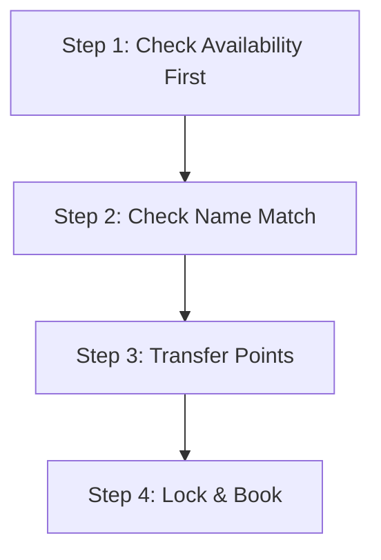

# 👑 The Layman's Guide to the Air India Maharaja Club (Flying Returns)

So you want to understand how to conquer the Air India points ecosystem in 2026? Here is the complete breakdown of how the newly revamped program works, where the massive sweet spots lie, and how to execute bookings.

---

## 💡 1. What is the Maharaja Club? (The 2026 Revamp)
On **April 1, 2026**, Air India officially retired the old, confusing distance-based loyalty charts and rolled out the simplified **Maharaja Club** (rebranding of Flying Returns). 

The program was overhauled with two massive goals:
1.  **Standardized Regional Rates**: It now uses fixed pricing depending on the region you are flying to (e.g., Delhi to anywhere in Western Europe/UK has a flat rate).
2.  **30% to 50% Point Reductions**: Award flights require significantly fewer points than in previous years.

---

## 💳 2. Earning Points: How to Fill the Vault
You don't just earn points by flying; you earn them primarily by using credit card points.

### Standard Airline Flights
*   You earn Maharaja Points whenever you fly on **Air India**, **Air India Express**, or any of their 25 **Star Alliance partners** (like Singapore Airlines, Lufthansa, Swiss, United, etc.).
*   *2026 Upgrade*: Points now post to your account within **2 hours** of landing.

### Credit Card Transfers (The Real Engine)
You can transfer points from major Indian credit card programs directly into your Air India account:
*   **HSBC Premier**: **1:1 Transfer Ratio** (1 HSBC Point = 1 Maharaja Point). This is the best transfer route in India.
*   **Axis Bank (Magnus / Atlas)**: **5:4 Transfer Ratio** (for Burgundy accounts; e.g., 5,000 Axis points = 4,000 Maharaja points). 
*   **SBI Cards**: **5:1 Transfer Ratio** (Avoid this at all costs; it devalues your credit card points by 80%).

---

## 📅 3. When to Plan: The Two Booking Windows
Timing is everything when booking flights with points. You have two distinct strategies:

### Window A: The Early Bird (330 to 355 Days Out)
*   Airlines release a baseline number of reward seats (usually 2 to 4 per flight) the moment the schedule opens, roughly **11 to 12 months in advance**.
*   **When to use**: If you are booking travel for peak holiday seasons (like mid-December or summer holidays) or traveling with family.

### Window B: The Last-Minute Sweep (T-7 to T-1 Days Out)
*   If a flight is departing in 2 to 7 days and has unsold seats, Air India will often open those seats up as points bookings to ensure the plane flies full.
*   **When to use**: If you are booking solo, spontaneous trips, or business travel.

---

## 🎯 4. What to Plan: The 2026 Sweet Spots
Here is where you get the most value for your points:

1.  **Direct Domestic Flights (From 1,500 Points)**:
    *   Short flights (like Delhi to Chandigarh or Mumbai to Goa) start at just **1,500 – 5,000 points**. This is cheaper than a train ticket.
2.  **The Europe / London Economy Hack (35,000 Points)**:
    *   Any direct flight from India (DEL/BOM) to Western Europe/UK (LHR) is a flat **35,000 points one-way** in Economy. 
    *   *Taxes/Fees*: Only around **₹4,500**, which is incredibly low.
3.  **The USA / Australia Flat Rate (40,000 Points)**:
    *   One-way Economy flights to North America or Australia start flat at **40,000 points**. 
4.  **Cabin Upgrades (From 20,000 Points)**:
    *   If you book a standard cash Economy ticket, you can upgrade to a flatbed Business Class seat starting at **20,000 points** for international sectors (if seats are available).

---

## 🛠️ 5. How to Plan: Step-by-Step Booking Guide

Follow this sequence to ensure your booking goes smoothly:

### Step 1: Search Before You Transfer
*   **Crucial Rule**: **Never transfer points from your bank until you verify the seat exists.** Point transfers are one-way; once they go to Air India, you cannot move them back to your bank.
*   Log into the Air India portal, enter your route and dates, and select **"Book with Points"**. Verify that the flight shows availability at the points rates listed above.

### Step 2: Check the Name Alignment
*   Ensure the first and last name on your credit card matches the name on your Maharaja Club account **exactly**. Mismatched names will trigger a fraud block, freezing your points for up to 14 days.

### Step 3: Initiate the Bank Transfer
*   **HSBC**: Transfers are generally processed within 24 to 72 hours.
*   **Axis**: Edge miles transfers usually post in 24 to 48 hours.
*   **Recommendation**: Keep a buffer of 2 days when planning, or check if you have points sitting in co-branded accounts that sweep automatically.

### Step 4: Book the Flight
*   Once the points land in your account, log back in, choose your flight, and complete the check-out. You will only pay the points amount plus the small cash component (government taxes/fees).
