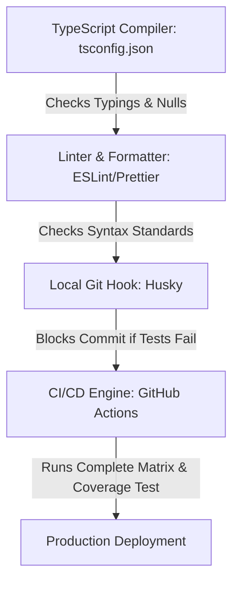

# Bug Prevention & QA Enforcement Playbook

This document details the programmatic gates, configurations, and verification layers implemented in **The Points Array** project to strictly enforce our Standard Operating Procedures (SOP) and prevent bugs from reaching production.

---

## 🛡️ The Multi-Layered Quality Gate Architecture



---

## ⚙️ Programmatic Gate Configurations

### 1. Strict TypeScript Compiler (`tsconfig.json`)
We disable type-leniency flags to force compiler errors on unsafe patterns:
```json
{
  "compilerOptions": {
    "strict": true,
    "noImplicitAny": true,
    "strictNullChecks": true,
    "strictFunctionTypes": true,
    "noImplicitThis": true,
    "alwaysStrict": true,
    "noUnusedLocals": true,
    "noUnusedParameters": true,
    "noImplicitReturns": true,
    "noFallthroughCasesInSwitch": true
  }
}
```

### 2. High-Coverage Testing Enforcers (`jest.config.js`)
We configure Jest to fail the test run if the core business engines (`src/utils/`) drop below 100% coverage thresholds:
```javascript
module.exports = {
  preset: 'jest-expo',
  collectCoverage: true,
  collectCoverageFrom: [
    'src/utils/**/*.ts',
    '!src/utils/**/*.d.ts'
  ],
  coverageThreshold: {
    global: {
      branches: 100,
      functions: 100,
      lines: 100,
      statements: 100
    }
  }
};
```

### 3. Local Commit Blockers (Husky `.husky/pre-commit`)
Husky intercepts the `git commit` command locally and executes validations. If a developer attempts to bypass tests or linting, the commit is aborted:
```bash
#!/bin/sh
. "$(dirname "$0")/_/husky.sh"

echo "Executing pre-commit quality gates..."
npm run lint && npm run format --check && npm run test -- --watchAll=false
```

---

## 🧪 TDD Edge-Case Testing Guide (Bug Prevention)

To verify the app is bulletproof, tests must specifically target standard failure modes:

### 1. API Network Failures (Mocked HTTP Boundaries)
Do not write tests that make live network calls. Use `axios-mock-adapter` or Mock Service Worker (MSW) to test app stability when external APIs return errors:
*   *Test Scenario*: Duffel API returns HTTP `503 Service Unavailable`.
*   *Assertion*: Assert that the app displays the recovery state panel instead of crashing or showing blank pages.

### 2. Malformed PDF Ingestion
*   *Test Scenario*: User uploads an empty PDF, an image-only PDF, or a statement from an unsupported bank.
*   *Assertion*: Assert that the `pdfParser` rejects the file with a specific `InvalidSchemaException` and updates the UI with a clean warning.

### 3. Accelerated Points Devaluation Boundary Check
*   *Test Scenario*: Matrix coefficients are modified mid-anniversary.
*   *Assertion*: Test that `matrixEngine` correctly evaluates spend calculations before and after the devaluation date.
