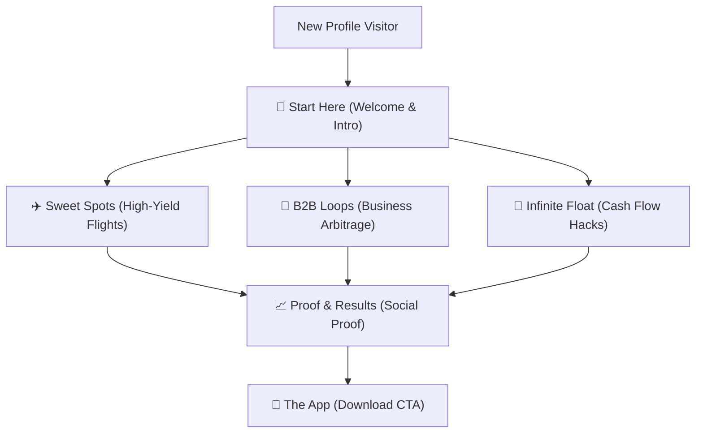

# 📸 Instagram Highlights Strategy & Cover Design Playbook

This document details the **Instagram Highlights Strategy** for `@thepointsarray`. Highlights (the pinned stories below the bio) serve as a persistent onboarding funnel, credibility ledger, and feature showcase for new profile visitors.

---

## 🎯 Highlights Framework & Funnel

Our highlights are structured to guide a user from absolute curiosity to high-intent actions (installing the app or booking a consultation).

---

## 🗂️ Pinned Highlights Categories

| # | Highlight Title | Purpose | Cover Icon Motif | Primary Call to Action (CTA) |
| :--- | :--- | :--- | :--- | :--- |
| 1 | **Start Here** | Welcomes visitors, explains the "Points Array" concept, and runs a quick wallet check. | Golden compass / greeting monogram | Link to App Download |
| 2 | **Sweet Spots** | Showcases high-yield airline award bookings (e.g. Delhi to London for ₹4,500). | Golden supersonic jet silhouette | Link to Award Search Tool |
| 3 | **B2B Loops** | Educates business owners on POS multipliers, GST payment routes, and supplier arbitrage. | Golden briefcase / business scales | Link to Business consultation |
| 4 | **Infinite Float** | Details debt rotation, 0% interest floats, and capital optimization. | Golden infinity symbol / loop | Link to Yield Calculator |
| 5 | **The App** | Features walkthroughs of the dashboard, MCC checker, and milestone trackers. | Golden smartphone with dashboard | Link to App Store / Play Store |
| 6 | **Reviews & Proof** | Collects screenshots of member bookings, luxury seat selfies, and testimonials. | Golden shield with star | Link to Concierge Booking |

---

## 🎨 Cover Design & Visual Identity

To maintain the premium "private concierge club" aesthetic, all Highlight covers will follow a unified template:
*   **Background**: Deep Space to Obsidian Black radial gradient (`#030406` to `#0B0C10`).
*   **Central Asset**: A photorealistic, high-fidelity 3D metallic gold icon (`#D4AF37`) sitting on a reflective obsidian mirror with dramatic volumetric lighting.
*   **Border**: None (let the round cover outline do the cropping).

---

## ✍️ Highlight Storyboards & Content Bank

### 1. 👋 Start Here (Welcome / Onboarding)
*   **Story 1 (Hook)**: Text over dark background: *"Are you earning 1% back on your cards while inflation is at 6%? You're losing money."*
*   **Story 2**: Intro video or text: *"Welcome to The Indian Points Array. We don't do cashback or toaster redemptions. We turn everyday spend into flatbed Business Class travel."*
*   **Story 3**: Simple explanation of the yield model: *"If 1 Reward Point = ₹0.25 on vouchers, but ₹3.00 on international flights... your points are worth 12x more if routed correctly."*
*   **Story 4 (CTA)**: Screenshot of the wallet auditor screen in the app. *"Audit your cards now. Tap link to download."*

### 2. ✈️ Sweet Spots (Flight Arbitrage)
*   **Story 1**: Delhi to London in Business Class for ₹4,500 (Axis Atlas to Aeroplan bridge).
*   **Story 2**: Qatar Airways Qsuite using British Airways BA Avios link (bypassing direct-transfer blocks).
*   **Story 3**: Air India domestic routes for 1,500 points (using Star Alliance partner bookings).
*   **Story 4 (CTA)**: *"Ready to fly flatbed? Tap to calculate your miles requirements."*

### 3. 💼 B2B Loops (Founder-Focused)
*   **Story 1**: The B2C POS loop: Routing B2B expenses through physical hotel POS terminals to retain 5X Atlas multipliers (7.64% net profit margin after fees).
*   **Story 2**: Tax & GST optimization: Stacking Amazon Pay GyFTR wallet loops to pay government challans and GST bills at 0% fees while printing points.
*   **Story 3 (CTA)**: *"If you spend ₹5 Lakhs+ monthly on business expenses, let's optimize your stack. Tap to schedule a portfolio audit."*

### 4. 🔄 Infinite Float (Financial Engineering)
*   **Story 1**: The "Infinite Float" concept: Swapping 15% interest personal debt for a 0% credit card rotation.
*   **Story 2**: Step-by-step math: IDFC ATM cash cashout (flat ₹295 fee) -> Pay loan -> Day 45 Amex POS swipe -> Settle IDFC. Net yield: ₹511 profit + 45 days capital float.
*   **Story 3**: The "Whale Bounce" (Floating ₹10L of working capital at a profit using Magnus + HSBC Premier).
*   **Story 4 (CTA)**: *"Calculate your limit rotations inside our app. Tap link to start."*

### 5. 📲 The App (Feature Walkthrough)
*   **Story 1**: Screengrab of the **Dashboard** showing active cards and milestone tracking.
*   **Story 2**: Walkthrough of the **MCC Checker**: Type "Uber" -> Shows 5X on Atlas, 10% on Swiggy HDFC.
*   **Story 3**: Walkthrough of the **Arbitrage Calculator**: Input cash price & point price -> Instantly shows if yield is "ELITE ARBITRAGE".
*   **Story 4 (CTA)**: App Store / Play Store download badges: *"Install the app and take control of your wallet."*

### 6. 📈 Reviews & Proof (Credibility Ledger)
*   **Story 1**: Direct DM screenshot: *"Bro, booked Delhi to Tokyo business class using the Aeroplan strategy you suggested! Cost me 60k points + 5k tax instead of ₹1.8L cash! 🙏"*
*   **Story 2**: Photo of a member holding a glass of champagne in an Emirates Lounge: *"HDFC Infinia milestones hit, points transferred to Skywards, lounge accessed. Thanks Points Array!"*
*   **Story 3**: DM screenshot: *"B2C POS loop worked perfectly. MDR fee was absorbed by the 5X travel multiplier. Saved ₹38,000 in operational costs."*
*   **Story 4 (CTA)**: *"Join the array. Submit your success story or book a concierge audit. Tap link."*
