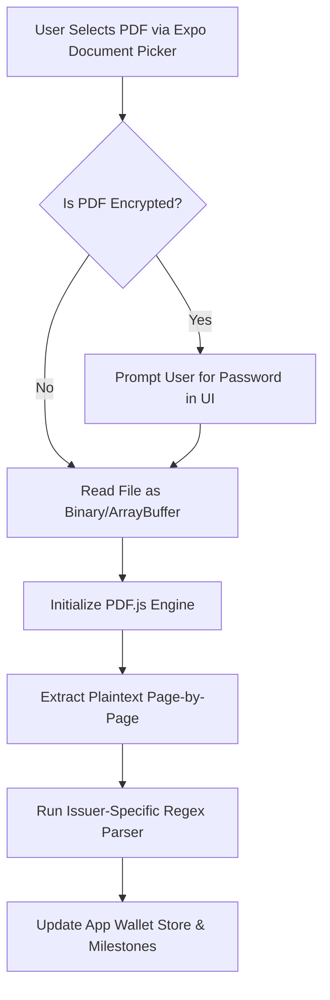

# Credit Card PDF Statement Parser Architecture

This document describes the technical architecture for securely injecting, decrypting, and parsing credit card statements (PDFs) on-device inside **The Points Array** application.

---

## 🔒 Security & Privacy Core Rules
1.  **Zero-Server Processing (100% Local)**: Credit card statements contain sensitive financial data. All parsing must occur locally on the user's device (sandbox) inside React Native or the browser window.
2.  **No Storage of Raw PDFs**: The PDF is processed in memory and discarded. Only the extracted numbers (milestone progress, reward balances) are written to local `AsyncStorage`.
3.  **Password Processing in Memory**: PDF passwords required to decrypt statements are processed in memory and never stored or sent over the network.

---

## 🛠️ Step-by-Step Technical Flow



### Step 1: File Ingestion (Picker UI)
*   **Mobile**: Use `expo-document-picker` to prompt the user to select files restricted to `application/pdf`.
*   **Web**: Use standard HTML5 `<input type="file" accept=".pdf" />`.
*   **Mobile Implementation**:
    ```typescript
    import * as DocumentPicker from 'expo-document-picker';

    const pickStatement = async () => {
      const result = await DocumentPicker.getDocumentAsync({
        type: 'application/pdf',
        copyToCacheDirectory: true,
      });
      if (!result.canceled) {
        return result.assets[0]; // URI of the file
      }
    };
    ```

### Step 2: Decryption & Loading (PDF.js)
*   Indian credit card statements are almost always password-protected (e.g., combinations of name and date of birth).
*   We load the document using **PDF.js** (Mozilla's open-source parser), passing the password if encrypted.
*   **Code Approach**:
    ```typescript
    import * as pdfjsLib from 'pdfjs-dist';

    const loadPdf = async (fileUri: string, password?: string) => {
      const loadingTask = pdfjsLib.getDocument({
        url: fileUri,
        password: password, // Decrypts PDF in memory
      });
      const pdf = await loadingTask.promise;
      return pdf;
    };
    ```

### Step 3: Text Extraction Loop
*   Loop through each page to scrape raw text lines:
    ```typescript
    const extractText = async (pdfDoc: any) => {
      let fullText = '';
      for (let i = 1; i <= pdfDoc.numPages; i++) {
        const page = await pdfDoc.getPage(i);
        const textContent = await page.getTextContent();
        const pageText = textContent.items.map((item: any) => item.str).join(' ');
        fullText += pageText + '\n';
      }
      return fullText;
    };
    ```

### Step 4: Issuer-Specific Regex Parsers (TDD Target)
*   Once we have the raw text, we run regex matchers depending on the card type selected by the user:

#### 💳 HDFC Infinia Parser
*   **Total Points Earned**: Look for string patterns matching reward ledger headers:
    `/\bOpening Balance\s+(\d+)\s+Points Earned\s+(\d+)\s+Points Disbursed\s+(\d+)\s+Closing Balance\s+(\d+)/i`
*   **Total Eligible Spends**: Sum transaction amounts excluding restricted categories (e.g., rent, utility payments marked with specific merchant descriptors).

#### 💳 American Express Platinum
*   **Membership Rewards Ledger**:
    `/\bMEMBERSHIP REWARDS SUMMARY\b.*?\bClosing Balance\b\s*([\d,]+)/i`

#### 💳 Axis Atlas
*   **Edge Miles Summary**:
    `/\bEDGE MILES SUMMARY\b.*?\bClosing Balance\b\s*([\d,]+)/i`

### Step 5: Updating App Milestones
*   Feed the parsed transaction total and rewards balance into the `AsyncStorage` local wallet store to update the UI dials and milestone charts dynamically.
