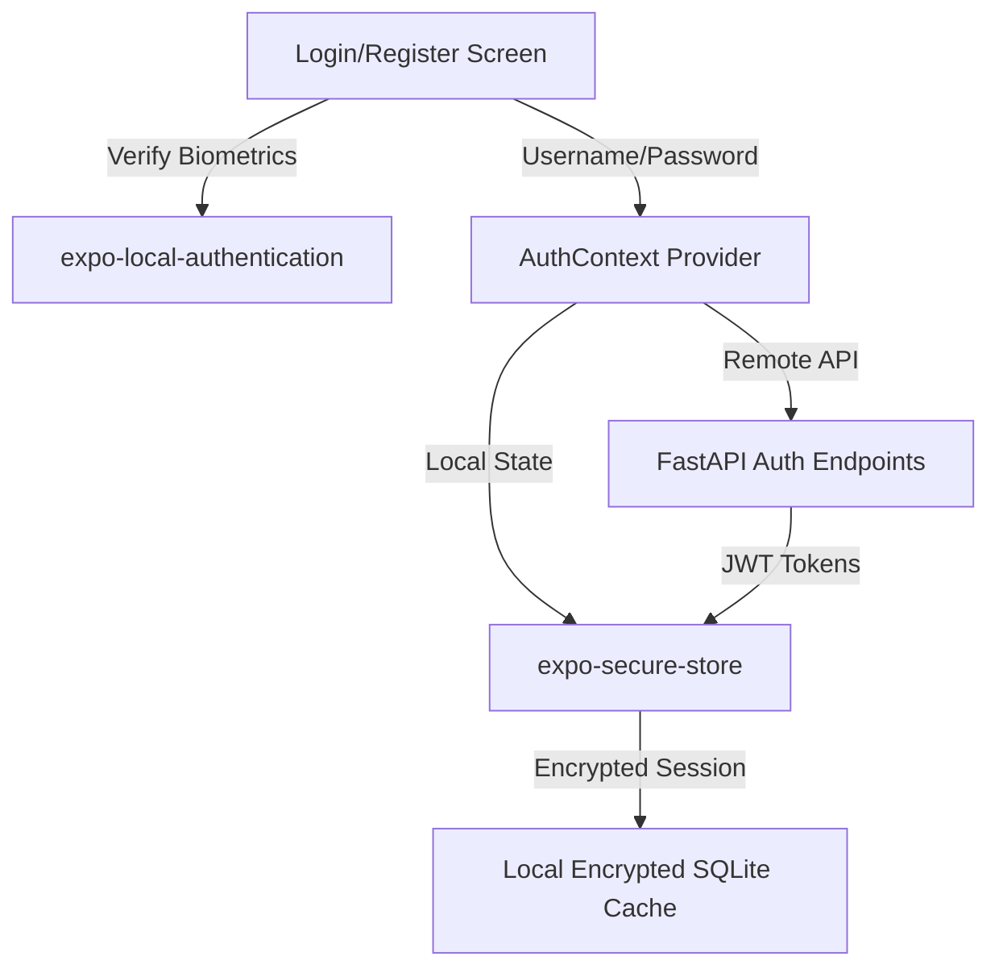

# Master Task List & Architecture Blueprint
**Date:** May 23, 2026  
**Project:** The Points Array Mobile Application (Expo v55)  
**Standard Execution Rule:** Strictly adhere to Test-Driven Development (TDD) and the established software engineering SOPs.

---

## 💎 1. Apple-esque Dynamic Experience Design Recommendations

To elevate the app from a static dashboard into a premium, responsive, and tactile "Apple-esque" experience, we will implement:

1. **Simulated Real-Time Telemetry (Live Tickers)**:
   - Introduce subtle fluctuating ticks in buy rate yields, live airline point valuations, and flight deal prices (e.g., updating every 8–15 seconds with green/red blink cues).
   - Use high-fidelity micro-charts (sparklines) showing historical valuation trends.
2. **Interactive Spring Animations (Reanimated v3)**:
   - Replaces linear easing with physical spring-damping simulations (`withSpring`) for list item entrance, tab switches, and expand/collapse cards.
3. **Tactile Haptic Feedback**:
   - Trigger light, success, and error haptic feedback using `expo-haptics` during calculations, list item selection, and form submission.
4. **Shimmer Skeleton Loaders**:
   - Replace generic spinners with high-fidelity shimmering placeholder graphics for text and images during load states.
5. **Glassmorphic Interactive Sliders**:
   - Redesign the Arbitrage Calculator sliders with glowing gradients, floating value bubble callouts, and real-time calculation yields that pulse on change.

---

## 🔒 2. Authentication System Architecture

We will implement a zero-trust, local-first secure registration and login framework.

### Key Architectural Layers:
- **Presentation Layer**: Custom forms with floating inputs, dynamic error hints, and biometric FaceID/TouchID quick-triggers.
- **Biometric Integration**: Utilizes Expo's native `expo-local-authentication` wrapper to check device support, enrollments, and prompt biometric login.
- **Secure Persistence Layer**: Uses `expo-secure-store` to cryptographically store credentials and JWT auth tokens in Keychain (iOS) and Keystore (Android).
- **Session Manager (`AuthContext`)**: Global state provider managing login, registration, password resets, and session expiry events.

---

## 📅 3. Actionable TDD Implementation Checklist

- [ ] **Task 1: Biometric and Password Authentication Context**
- [ ] **Task 2: Apple-esque Floating Login & Registration Forms**
- [ ] **Task 3: Dynamic Valuation Ticker & Live Sparkline Widgets**
- [ ] **Task 4: Interactive Shimmer Skeleton Loader Component**
- [ ] **Task 5: Tactile Haptics and Reanimated Spring Transitions**
- [ ] **Task 6: Seamless Session Auto-Login & Splash Guard**
- [ ] **Task 7: Route Protection and Redirection Guards**

---

## 🧪 4. TDD Blueprints for Each Task

### Task 1: Biometric and Password Authentication Context
*   **Target File**: `src/context/AuthContext.tsx`
*   **Test File**: `src/__tests__/authContext.test.tsx`
*   **TDD Blueprint**:
    *   **Arrange**: Mock `expo-secure-store` and `expo-local-authentication`.
    *   **Act**: Call `login('admin', 'password')` and `authenticateBiometrics()`.
    *   **Assert (Fails First)**: Verification fails because `AuthContext` is unimplemented.
    *   **Pass Condition**: Securely save tokens in secure store and set the user session state.

### Task 2: Apple-esque Floating Login & Registration Forms
*   **Target File**: `src/components/AuthForm.tsx`
*   **Test File**: `src/__tests__/authForm.test.tsx`
*   **TDD Blueprint**:
    *   **Arrange**: Render `AuthForm` with mock login triggers.
    *   **Act**: Input invalid email, then submit form.
    *   **Assert (Fails First)**: Email validation fails or input fields are not styled.
    *   **Pass Condition**: Dynamic error inline warnings render; biometric buttons call auth context.

### Task 3: Dynamic Valuation Ticker & Live Sparkline Widgets
*   **Target File**: `src/components/LiveValuationTicker.tsx`
*   **Test File**: `src/__tests__/liveValuationTicker.test.tsx`
*   **TDD Blueprint**:
    *   **Arrange**: Pass initial yield rate of `0.42` INR/pt.
    *   **Act**: Fast-forward timers by 10 seconds.
    *   **Assert (Fails First)**: The output remains statically `0.42` without changes.
    *   **Pass Condition**: Implement `setInterval` state update logic simulating subtle market ticks and recording them to a sparkline data array.

### Task 4: Interactive Shimmer Skeleton Loader Component
*   **Target File**: `src/components/ShimmerLoader.tsx`
*   **Test File**: `src/__tests__/shimmerLoader.test.tsx`
*   **TDD Blueprint**:
    *   **Arrange**: Mount `ShimmerLoader` with width `300` and height `100`.
    *   **Act**: Verify reanimated loop properties.
    *   **Assert (Fails First)**: Loader fails to animate or render correctly.
    *   **Pass Condition**: Utilize Reanimated's `withRepeat` and `withTiming` to animate a linear gradient mask over a transparent background base.

### Task 5: Tactile Haptics and Reanimated Spring Transitions
*   **Target File**: `src/utils/haptics.ts` & `src/components/SpringView.tsx`
*   **Test File**: `src/__tests__/springView.test.tsx`
*   **TDD Blueprint**:
    *   **Arrange**: Mock `expo-haptics`.
    *   **Act**: Tap active spring button.
    *   **Assert (Fails First)**: No haptics called, transition uses default linear rendering.
    *   **Pass Condition**: Execute `Haptics.impactAsync` on interactions, wrapping elements in animated spring bounds.

### Task 6: Seamless Session Auto-Login & Splash Guard
*   **Target File**: `src/context/AuthContext.tsx` (auto-load block)
*   **Test File**: `src/__tests__/authContext.test.tsx`
*   **TDD Blueprint**:
    *   **Arrange**: Pre-seed the mock `expo-secure-store` with a valid active session token.
    *   **Act**: Initialize the `AuthProvider`.
    *   **Assert (Fails First)**: Context defaults to `loading: false, user: null`, requiring manual interaction.
    *   **Pass Condition**: Resolve token verification inside `useEffect` before dismissing the Splash Overlay, restoring session state seamlessly.

### Task 7: Route Protection and Redirection Guards
*   **Target File**: `src/app/_layout.tsx` (guard router transitions)
*   **Test File**: `src/__tests__/routeGuard.test.tsx`
*   **TDD Blueprint**:
    *   **Arrange**: Simulate unauthenticated auth state (`user: null`).
    *   **Act**: Attempt navigation to protective route `/concierge` or `/insights`.
    *   **Assert (Fails First)**: Route renders sensitive user panels successfully.
    *   **Pass Condition**: Intercept route shifts, redirecting users to the `/login` route when unauthenticated.

---

## 🔄 5. User Experience Continuity Requirements

1. **Optimistic State Syncing**:
   - Any modifications to local user balances or details will update client-side immediately while the sync request is dispatched in the background. If offline, mutations are stored in the local SQLite transaction queue.
2. **State Restoration & Session Refresh**:
   - Save active navigation tabs and form details (e.g. current passenger names) in transient store. If the application is closed or restarted, restore user state to prevent data loss.
3. **Graceful Connection Transitions**:
   - Intercept network drop/restore signals (`@react-native-community/netinfo`) to show a non-obtrusive luxury banner notifying the user that they are in "Offline Mode - Cached Data Active" rather than throwing generic connection errors.
