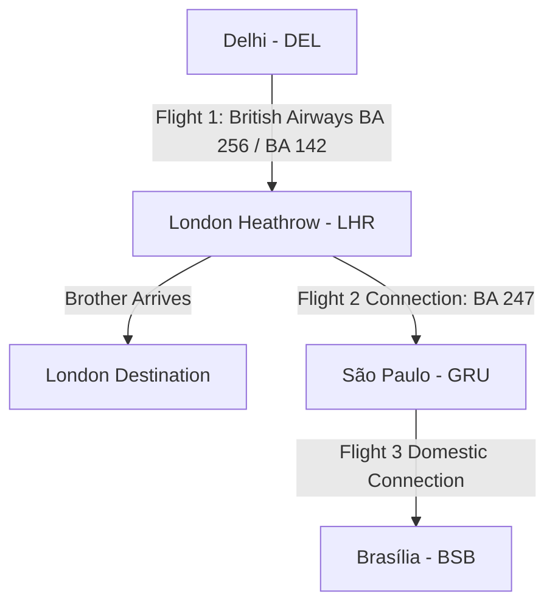

# Master Task List & Architecture Blueprint
**Date:** May 24, 2026  
**Project:** The Points Array Mobile Application (Expo v55)  
**Standard Execution Rule:** Strictly adhere to Test-Driven Development (TDD) and the established software engineering SOPs.

---

## 💎 1. UI/UX Refinement & Google Standards Polish Checklist

Based on the direct visual critique of the running application on the Android device, the following visual refinement tasks are established for today's milestone:

- [ ] **Task 1: Fix Android TextInput Vertical Text Clipping**
  - **Issue**: Numbers inside `PORTFOLIO BALANCE` and `ANNUAL SPEND (INR)` fields are clipped at the top because of default Android padding inside low-height containers (36dp).
  - **Solution**: Inject `paddingVertical: 0` and `textAlignVertical: 'center'` into `cardInput` in `src/components/WalletCard.tsx`.
- [ ] **Task 2: Search Bar Placeholder Clipping**
  - **Issue**: The search input placeholder string `Search "London", "Maldives` gets cut off on the right, lacking a closing double quote.
  - **Solution**: Shorten placeholder text to `Search destinations...` or dynamically adjust scale.
- [ ] **Task 3: Point Calculator Spacing & Accessibility**
  - **Issue**: Form labels `HOTEL CASH PRICE (INR)` and `POINTS REQUIRED` are small (10px) with poor contrast, and the calculator form is cramped directly below the sub-navigation tabs.
  - **Solution**: Increase font size to 11px, update color to `#9CA3AF`, and inject `marginTop: Spacing.six` on the form container.
- [ ] **Task 4: Card Carousel Pagination & Scroll Indicators**
  - **Issue**: The horizontal credit card carousel lacks pagination indicators, forcing users to swipe blindly.
  - **Solution**: Implement page control indicator dots (or a native scroll progress bar) directly below the card carousel.
- [ ] **Task 5: Contrast Normalization on Metallic Gradients**
  - **Issue**: HSBC Card background uses a light peach/pink gradient, making the grey text elements (`#374151` and `#4B5563`) look muddy and low-contrast.
  - **Solution**: Switch text styling on light cards to high-contrast charcoal (`#111827`) or utilize a darker gradient wash.
- [ ] **Task 6: Spacing & Content Hierarchy in News Timeline**
  - **Issue**: Floating tags (`DEVALUATION` / `SWEET SPOT`) and dates sit directly underneath image boundaries with identical margin constraints, causing visual congestion.
  - **Solution**: Implement structured margins: `marginTop: Spacing.four` for images and `marginVertical: Spacing.two` for tag rows.
- [ ] **Task 7: Simulator Interaction Indicators**
  - **Issue**: Quick Deal simulator cards look like static images; there is no visual cue indicating they can be tapped to populate the form.
  - **Solution**: Overlay a subtle play/click icon badge in the top-right corner of the image card, or add a persistent instruction label.

---

## 🧪 2. TDD Blueprints for Poland Tasks

### Task 1: Fix Android TextInput Vertical Text Clipping
*   **Target File**: `src/components/WalletCard.tsx`
*   **Test File**: `src/__tests__/walletCard.test.tsx`
*   **TDD Blueprint**:
    *   **Arrange**: Render `WalletCard` with dummy details.
    *   **Act**: Retrieve styles associated with the `cardInput` TextInput container.
    *   **Assert**: Ensure `paddingVertical` is explicitly defined as `0` and `textAlignVertical` is `'center'` to prevent layout engine clipping.

### Task 3: Point Calculator Spacing & Accessibility
*   **Target File**: `src/components/ArbitrageCalculator.tsx`
*   **Test File**: `src/__tests__/arbitrageCalculator.test.ts`
*   **TDD Blueprint**:
    *   **Arrange**: Render the calculator.
    *   **Act**: Inspect label style properties.
    *   **Assert**: Verify font size is greater than or equal to `11` and container gap uses standard Spacing multipliers.

---

## 🔄 3. User Experience & Travel Routing Strategy

### Delhi to London / Brasilia Family Travel Plan (May 29, 2026)

#### Core Parameters:
*   **Date**: Thursday, May 29, 2026 (Last-minute peak season travel)
*   **Passengers**: 
    1. Brother (Route: DEL ➔ LHR)
    2. Wife + 2 Kids (Route: DEL ➔ BSB)
*   **Active Point Portfolio**: 
    *   Axis Magnus for Burgundy (`axis_m4b`): **56,000 points**
    *   Amex Platinum Charge (`amex_platinum`): **120,000 points**

#### Optimal Routing & Booking Strategy:

1.  **Shared Initial Leg (Keep Family Together)**:
    *   Book the **Delhi (DEL) to London (LHR)** segment on the same flight for all 4 travelers (e.g. British Airways or Air India). This allows the brother to assist the wife and two kids during the initial 9-hour long-haul flight.
2.  **Brother's Booking (DEL ➔ LHR)**:
    *   **Award Booking**: Utilize points to book an Economy award seat on British Airways or Virgin Atlantic.
    *   *BA Route*: 20,000 Avios + ~₹15,000 taxes. Transfer **25,000 Axis Magnus points** to British Airways Executive Club (5:4 ratio, yields 20,000 Avios).
    *   *Alternative (Virgin)*: 10,000 Virgin points + taxes. Transfer **20,000 Amex points** to Virgin Atlantic (2:1 ratio).
3.  **Family's Booking (DEL ➔ LHR ➔ GRU ➔ BSB)**:
    *   **Cash Booking with Points Co-Pay**: Because award seats for 3 passengers to Brazil (requires 210k - 300k miles) are unavailable last-minute, book a cash ticket for DEL-LHR-GRU-BSB via British Airways (connections to São Paulo and Brasília via partner GOL/LATAM).
    *   **Amex Travel Portal**: Utilize the remaining **120,000 Amex points** on the Amex Travel portal to offset the cash fare via SafeKey (valued at ~₹30,000 to ₹40,000 discount) or book via the Centurion/Platinum travel desk to access special airline companion deals.
