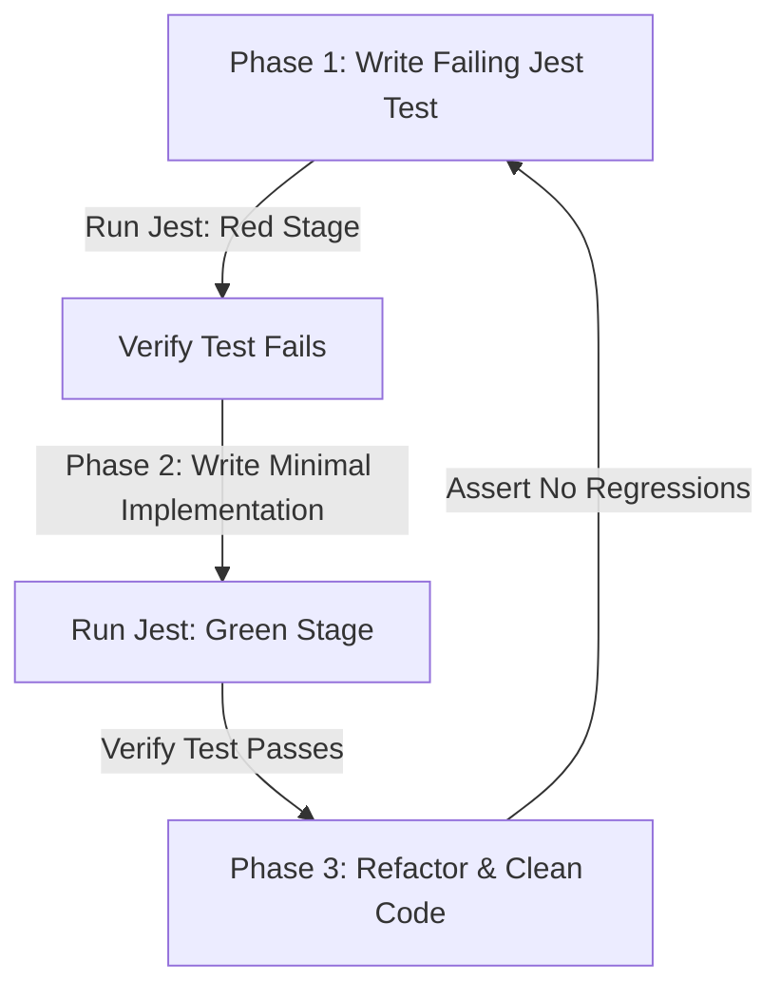

# TDD SOP & Cross-Platform Quality Assurance Specification

This document provides a forensic critique of our tech stack, explains our cross-platform isolation mechanics, and establishes our strict Standard Operating Procedure (SOP) for Test-Driven Development (TDD).

---

## 🔍 Tech Stack Critique & Performance Mitigations

While **Expo v55** and **React Native** offer fast developer velocity, we must address two primary weaknesses:
1.  **Single-Threaded JS Engine Load**: Running Mozilla's `pdfjs-dist` to parse a 10MB credit card statement (with thousands of transactions) on the main JS thread will block UI interactions and cause frame drops.
    *   *Mitigation*: We must execute the statement parser inside a React Native background thread using `InteractionManager.runAfterInteractions` or offload it to a web worker wrapper.
2.  **Native Document Pickers**: File access APIs differ slightly between iOS and Android.
    *   *Mitigation*: We encapsulate the entry point behind a clean interface module `pickerAdapter.ts` to expose a single normalized return payload.

---

## 📱 Mobile Platform Independence & Device Consistency

### 1. Unified Execution (Hermes Engine)
Expo v55 compiles and runs JavaScript using the **Hermes** engine on both iOS and Android. This guarantees that JS features, regex parsing engines, date calculations, and JSON parsing behave identically on both OS platforms.

### 2. UI Layout Consistency
To prevent layout divergence across screen sizes and aspect ratios:
*   **Flexbox Grid**: Use React Native Flexbox layout parameters instead of absolute hardcoded pixel positions.
*   **Safe Area Handling**: Wrap all views with `react-native-safe-area-context` to handle notches and device-specific status bars cleanly.
*   **Font Scaling Bounds**: Lock component typography maximum scaling factors to prevent broken grids on accessibility-enabled devices:
    ```typescript
    // src/components/Typography.tsx
    Text.defaultProps = Text.defaultProps || {};
    Text.defaultProps.allowFontScaling = false; // Prevents overflow on custom device zoom settings
    ```

---

## 🧪 Standard Operating Procedure (SOP) for TDD

We execute a strict **Red-Green-Refactor** loop for every single feature.



### Strict Code Rules to Enforce TDD
1.  **Prerequisite Test Files**: For every new business module `module.ts` created under `src/utils/`, a corresponding `module.test.ts` file must be generated *first* inside `src/__tests__/`.
2.  **Git Pre-Commit Hook (Husky)**: Configured Husky commands prevent code commits if coverage drops below the required metrics:
    ```bash
    # runs pre-commit test validation
    npm run test -- --changedSince=origin/main --coverageThreshold='{"global":{"branches":100,"functions":100,"lines":100}}'
    ```
3.  **CI/CD Pull Request Gate**: Pull Requests cannot be merged if code coverage drops or if any test fails.

---

## ⚙️ Example TDD Workflow: The Matrix Engine

To illustrate the SOP, when building the matrix parser:

### Step 1: Write Failing Test (`src/__tests__/matrixEngine.test.ts`)
```typescript
import { getTransferRatio } from '../utils/matrixEngine';

describe('Matrix Engine Ratio Verification', () => {
  it('should return correct 5:4 ratio for Axis Atlas to Marriott Bonvoy', () => {
    // Assert
    expect(getTransferRatio('axis_atlas', 'marriott_bonvoy')).toBe(1.25);
  });
});
```
*Result*: Running `npm test` fails immediately with `TypeError: getTransferRatio is not a function`.

### Step 2: Write Minimal Code (`src/utils/matrixEngine.ts`)
```typescript
export const getTransferRatio = (cardId: string, partnerId: string): number => {
  if (cardId === 'axis_atlas' && partnerId === 'marriott_bonvoy') {
    return 1.25;
  }
  return 0;
};
```
*Result*: Running `npm test` passes successfully (Green stage).

### Step 3: Refactor
Extend the logic to load from `transferMatrix.json` dynamically while asserting the test continues to pass.

---

## 🎨 Visual Asset Quality Assurance SOP

To ensure premium aesthetics without jagged, cropped outlines or "sticker-floating" artifacts, all programmatically generated graphics must pass a strict Visual Quality Assurance (VQA) check.

### 1. The Blending & Transparency Standard
*   **No Jagged Borders:** Keying out solid backgrounds must use a **luminance-mapped smooth alpha transition** (feathering) rather than a hard color threshold.
*   **Feathered Edges:** The transition zone ($0 < \text{alpha} < 255$) must contain a smooth gradient of alpha values to prevent pixelated halos on dark backgrounds.
*   **Shadow Grounding:** Every floating 3D motif must have a contact shadow beneath it to ground it in space.

### 2. The Verification Loop
Before committing any visual slides to the remote repository, developer agents must run automated verification checks (using Python scripts like `scripts/test_image_blending.py`) to validate transparency gradients and verify that no hard cropping occurred.
