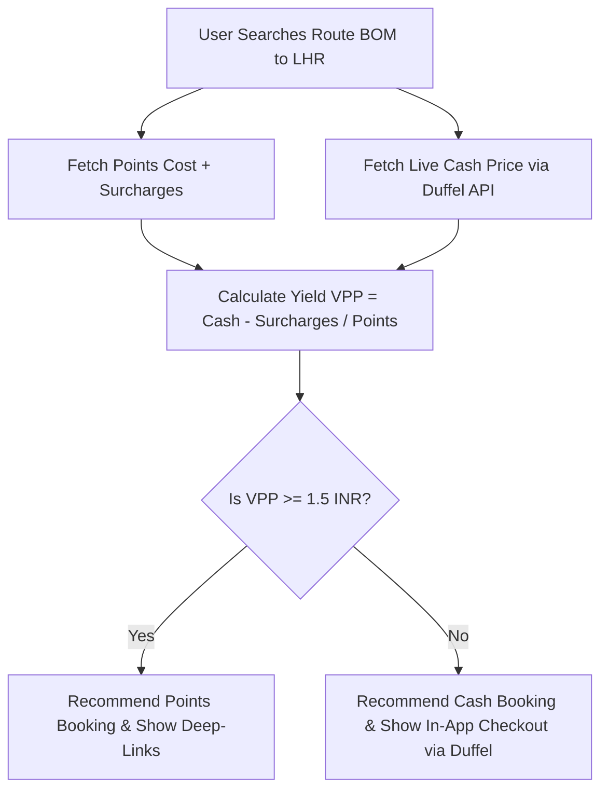

# Travel API (Duffel) Integration Blueprint

This document outlines the technical design for integrating a modern flight/travel booking API (specifically **Duffel**) into **The Points Array** application to handle cash-fallback bookings, compute live arbitrage yield, and drive affiliate revenue.

---

## 🎯 Strategic Objective
When a user searches for an itinerary, the app compares the loyalty points cost against live cash pricing. If the calculated yield is low, the app recommends a cash booking and allows the user to buy the ticket directly in-app, yielding affiliate commissions.



---

## 🛠️ Technical Implementation Flow

### 1. API Vendor Selection: Duffel
*   **Why**: Unlike traditional GDS systems (Amadeus/Sabre), Duffel offers a developer-friendly JSON REST API, React Native compatibility, and built-in flight booking orchestration (handling luggage, seat selection, and passenger details).

### 2. Live Pricing Search (Backend Request)
*   **Code Location**: `src/utils/travelApi.ts`
*   **Approach**: Run a search request for flights. Duffel returns a list of active flight offers with exact pricing, tax breakdowns, and booking tokens.
*   **API Request Example**:
    ```typescript
    import axios from 'axios';

    export const searchCashFlights = async (origin: string, destination: string, departureDate: string) => {
      const response = await axios.post(
        'https://api.duffel.com/air/offer_requests',
        {
          data: {
            slices: [{ origin, destination, departure_date: departureDate }],
            passengers: [{ type: 'adult' }],
            cabin_class: 'business',
          },
        },
        {
          headers: {
            'Authorization': `Bearer ${process.env.DUFFEL_API_KEY}`,
            'Duffel-Version': 'v2',
            'Content-Type': 'application/json',
          },
        }
      );
      return response.data.data.offers; // Returns array of live cash offers
    };
    ```

### 3. Yield Arbitrage Recalculator
*   Input the cheapest cash price returned by Duffel into the VPP formula:
    $$\text{Value per Point (VPP)} = \frac{\text{Duffel Cash Price} - \text{Points Cash Surcharge}}{\text{Points Cost} \times \text{Transfer Ratio}}$$
*   If $VPP < \text{₹1.5}$, the app hides the "Transfer Points" button and displays:
    *   *Alert Panel*: *"We recommend booking with cash. Points value is poor for this route (₹0.85/point vs. cash price ₹62,000)."*
    *   *Primary Action Button*: **"Book Cash Flight (₹62,000)"**

### 4. In-App Checkout & Booking
*   Users enter passenger details directly into a clean forms component.
*   Duffel processes the checkout via their platform, charging the user's card and issuing the ticket (PNR) instantly.
*   **Affiliate Payout**: Duffel passes back a commission (typically 1-3%) directly to our corporate developer account.
